# Hemodialysis Management System

 Database Management system (DBMS) Specific for Hemodialysis Department
 

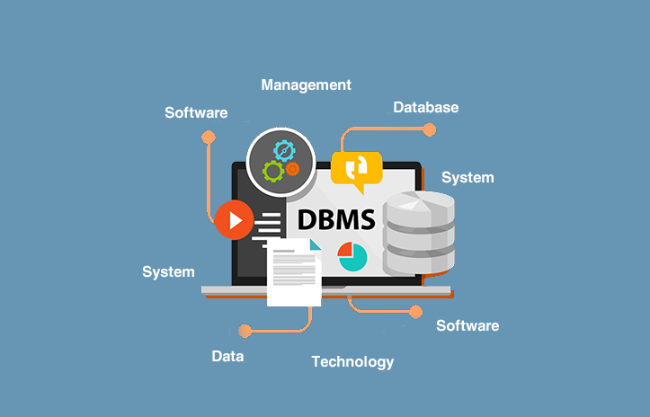

<h2> Software Specifications </h2>

* ### Back-End
    1. Flask Server
    2. MySQL Database
    3. Ampps local development stack
    4. Postman for testing

* ### Front-End
    1. HTML, CSS 
    2. Java Script
    3. Bootstrap
    
<h2> Contents </h2>

1.  [Introduction](https://github.com/Radwa-Saeed/Hemodialysis#1-introduction)
2.  [Features](https://github.com/Radwa-Saeed/Hemodialysis#2-features)
3.  [Design](https://github.com/Radwa-Saeed/Hemodialysis#3-design)
4.  [Run App](https://github.com/Radwa-Saeed/Hemodialysis#4-run-app)

## 1. Introduction

The purpose of this project is to computerize the Front Office Management of the Hospital Hemodialysis Department to develop software which is user friendly simple, fast, and cost-effective.

 It deals with the collection of patient’s information, diagnosis details, etc. Traditionally, it was done manually.

 
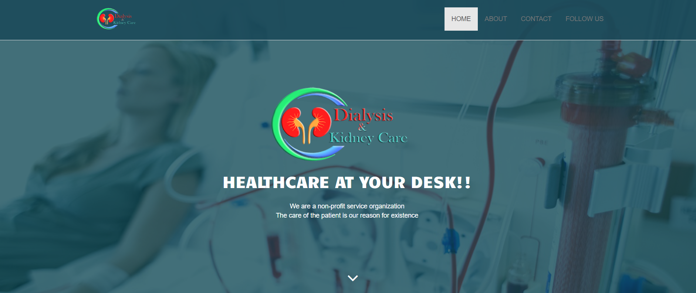

 
## 2. Features 

 * The main function of the system is register and store patient details and doctor details and retrieve these details as and when required, and also to manipulate these details meaningfully.

 

 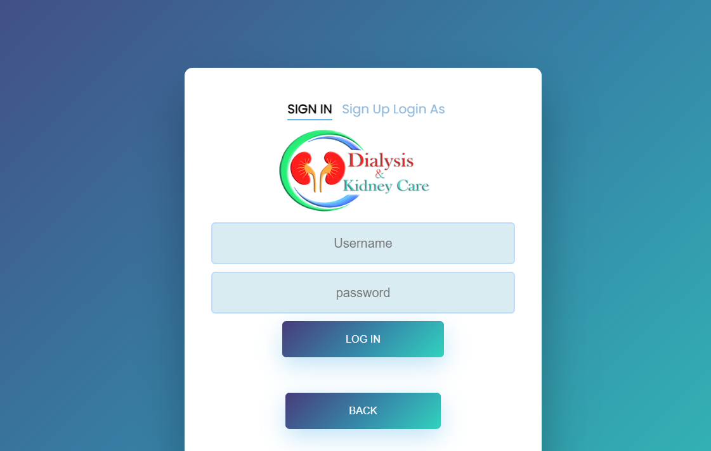
 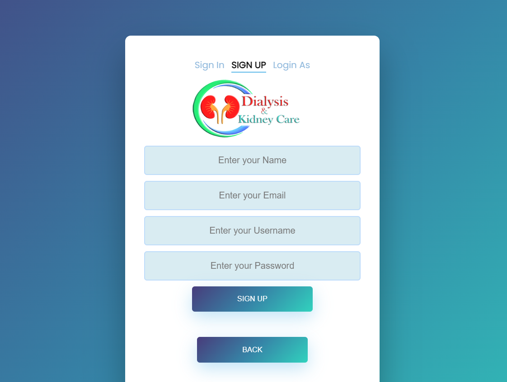
 

 
* System input contains patient details, diagnosis details, whilesystem output is to get these details on to the screen.

* The Hemodialysis Management System can be entered using a username and password.
* It is accessible either by anadministrator or receptionist. Only they can add data into the database.
* The data can be retrieved easily.
* The data are well protected for personal use and makes thedata processing very fast

## 3. Design

* After Registeration the user will be redirected to the main page and according to the user's role he/she will be able to access and manipulate with specific data

* ## Main Page

 

 
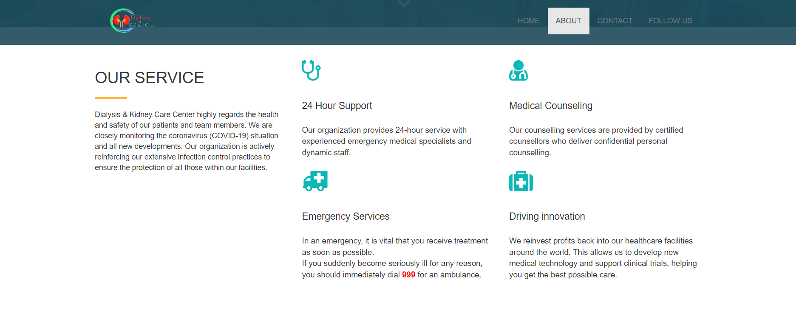

 
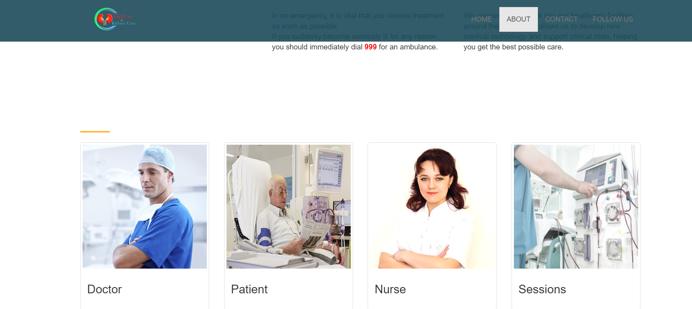

 
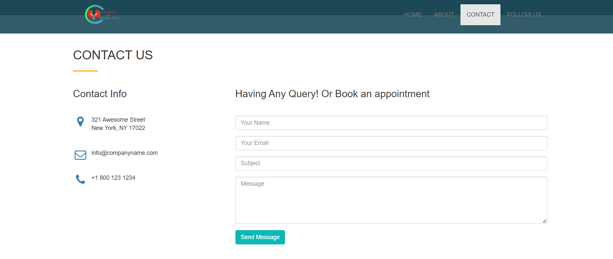

 
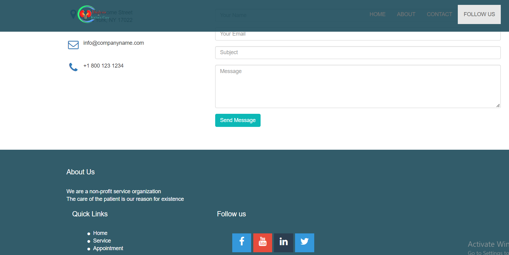

* ## Add Page

 
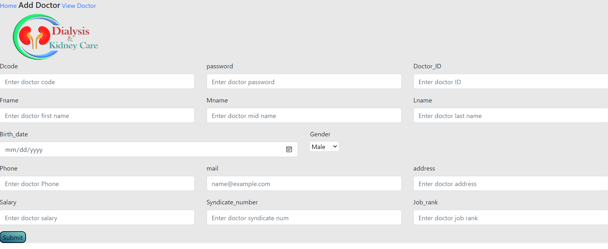

* ## View Page

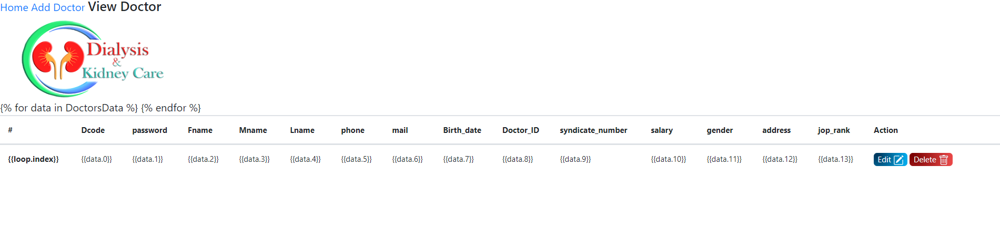

* ## Data Base Tables Sample

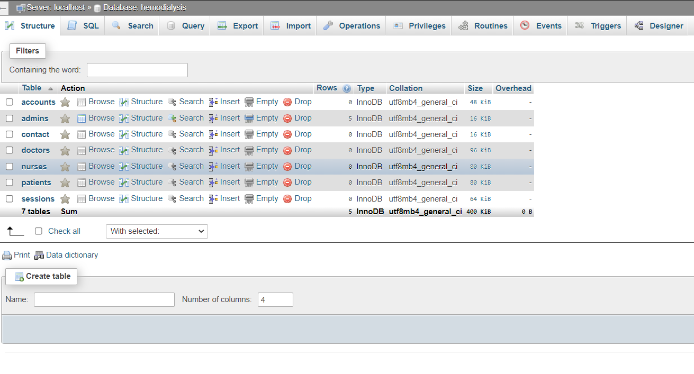

## 4. Run App
1. open server.py
2. right-click then run python file in terminal
3. write (http://127.0.0.1:5000/) in your prowser
